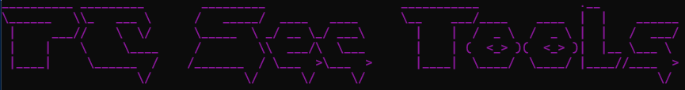
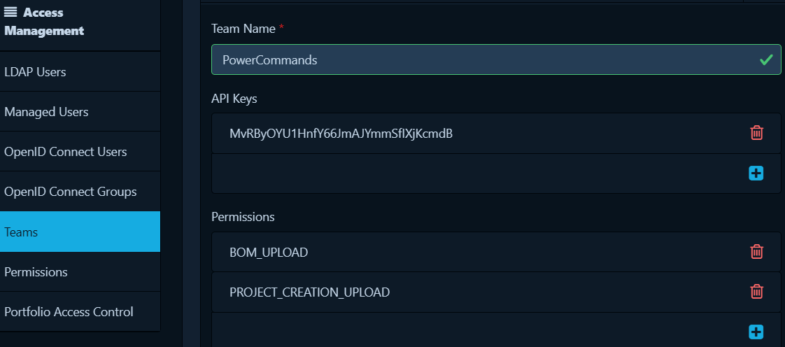

# PainKiller Security Tools


This repo contains a Power Command Console project with different commands with some kind of security purpose

# Prerequisites
You need DockerDesktop or equivalent software installed to run Cdxgen Sbom creation.

## Start
```start```

**The following steps will be done by the ```start``` command**
 - Starts docker desktop on your machine if it´s not already started ()
 - Start Cdxgen server to create sbom content, this will spin up the docker container for you. Make sure that you set the property ```sdxGenServerVolumeMount``` in the ```PowerCommandsConfiguration.yaml``` configuration file first.
 - Download ```docker-compose.yaml file```, path must be set in configuration file, if the file is already downloaded, this step will be skipped, that way you can change settings in the compose file if you want.
 - Start the Dependency Tracker Web GUI and API server. (Docker container) default url is: http://localhost:8080 login with ```admin```:```admin```

## Good to know, before you creating Sbom files...
You can create the files and add them to **Dependency Track** manually if you want but the sbom command will also try to upload them if you use the ```--upload``` option flag. For this to work you will need to configure **Dependency Track** a bit. You need to create a **Team** in the **Administration/Access Management** section, and add at least the permission that is shown in the image below.



After that copy the API key and create a secret in PowerCommands with this command.

```secret --create "DT_PowerCommand"```

After this configuration sbom will be uploaded to **Dependency Track**.

## Sbom
Create sbom content from a local path or github repository

**Local path**

```sbom --path <local path> --NAME <my-sbom-name>```

**Github repository**

```sbom --path https://github.com/PowerCommands/PowerCommands2022.git --NAME <my-sbom-name>```

### --upload
If you add the --upload option, the sbom will also be uploaded to Dependency Tracker, a new project with the --NAME value will be created. 

```sbom --path https://github.com/PowerCommands/PowerCommands2022.git --NAME <my-sbom-name> --upload```

___

Read more about SBOM: https://www.cisa.gov/sbom

## CycloneDX Generator


[CycloneDX Generator](https://github.com/CycloneDX/cdxgen) on github. 

## Dependency Track


[Dependency Track](https://github.com/CycloneDX/cdxgen) on github. 
