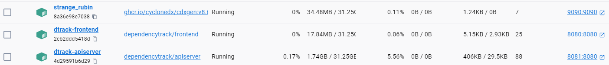

# PainKiller Security Tools


This repo contains a Power Command Console project that combines **CycloneDX** and **Dependency Track** to let you create SBOM files from git repos and import them in to OWASP Dependency Track which gives you a nice GUI where you can analyze your repos vulnerabilities. 

# Prerequisites
If this is the first time you use a Power Commands implementation a encryption setup will be done at the first startup. The encryption key is setup for all Power Commands projects and is unique for every machine. Encryption is used by this Power Commands project to secure your **Dependency Track** API key.

This application is intended to use **CycloneDX** and **Dependency Track** software running as container, therefore you need to have Docker Desktop installed, this way you do not need to install software on your machine besides this Power Commands console application. Setup Docker Desktop is however not described in this documentation. 

If you want to setup **CycloneDX** and **Dependency Track** in any other way, I recommend you to look at their respective documentation, links to their repos are present at the end of this document. You also need to adjust the ```PowerCommandsConfiguration.yaml``` configuration file with the appropriate API endpoints. You do not need to run the ```start``` command nor the ```setup --docker``` command if the software is installed and already running on your machine or a server else where.

## Setup 
### Setup docker containers
```setup --docker```

This will pull down the docker images needed if you want to run this with Docker Desktop, which is:
- ghcr.io/cyclonedx/cdxgen:v8.6.0
- dependencytrack/apiserver
- dependencytrack/frontend

### Setup Dependency Track API key
```setup dt-key```

Paste the API key copied from the Dependency Track Admin, this is only needed if you intend to automatically import your sbom file into Dependency Track (and why shouldn't you do that?).
You must of course start Dependency Track with the ```start``` command described below.

## Start
```start```

You do not need to run this command if your containers is already running or if you have CycloneDX and Dependency Track hosted on your machine or a server.



**The following steps will be done by the ```start``` command**
 - Starts docker desktop on your machine if it´s not already started ()
 - Start Cdxgen server to create sbom content, this will spin up the docker container for you. Make sure that you set the property ```sdxGenServerVolumeMount``` in the ```PowerCommandsConfiguration.yaml``` configuration file first. 
 - Start the Dependency Tracker Web GUI and API server. (Docker container) default url is: http://localhost:8080 login with ```admin```:```admin```

 NOTICE! The first time you run startup the containers needed to run by DockerDesktop on your machine will be downloaded, this could take some time, but you see the process in the console, have patience with that. 

## Good to know, before you creating Sbom files...
You can create the files and add them to **Dependency Track** manually in the GUI. But if you configure **Dependency Track** and **PowerCommands** you been able to us the ```--upload``` option flag and with that the sbom content is automatically uploaded to **Dependency Track**. First tou need to create a **Team** in the **Administration/Access Management** section, and add at least the permission that is shown in the image below.  


After that copy the API key and create a secret in PowerCommands with this command.

```setup dt-key```

After this configuration is done, the sbom content will be uploaded to **Dependency Track**.

## Sbom
Create sbom content from a local path or github repository

**Local path**

```sbom --path <local path> --NAME <my-sbom-name>```

**Github repository**

Please notice that https://github.com/PowerCommands/PowerCommands2022.git is just for the example, you can point at any git repository, I do not think that my Power Commands repo is that interesting for you.

```sbom --path https://github.com/PowerCommands/PowerCommands2022.git --NAME <my-sbom-name>```

### --upload
If you add the --upload option, the sbom will also be uploaded to Dependency Tracker, a new project with the --NAME value will be created. 

```sbom --path https://github.com/PowerCommands/PowerCommands2022.git --NAME <my-sbom-name> --upload```

___

## Trouble shoot
If you having trouble to start Dependency Track or login from Dependency Track, open Docker Desktop and make sure that the containers is running.


## Power Commands

Read more about Power Commands: https://github.com/PowerCommands/PowerCommands2022

Read more about SBOM: https://www.cisa.gov/sbom


## CycloneDX Generator
[CycloneDX Generator](https://github.com/CycloneDX/cdxgen) on github. 

## Dependency Track

[Dependency Track Community](https://github.com/DependencyTrack) on github. 
